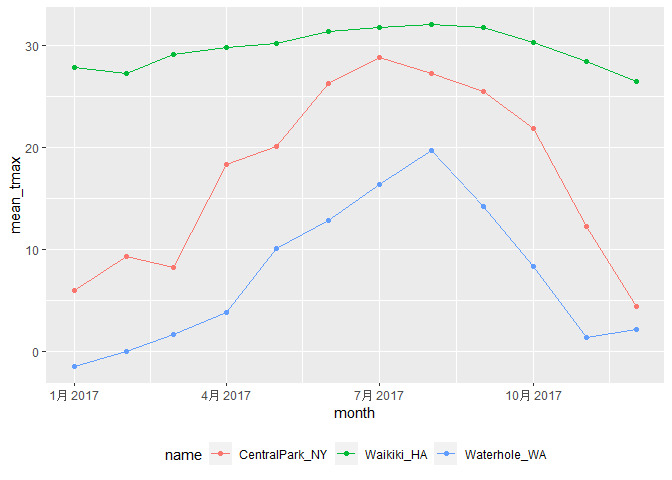

EDA
================
Lectured by Jeff Goldsmith
2022-10-06

``` r
library(tidyverse)
```

    ## ── Attaching packages ─────────────────────────────────────── tidyverse 1.3.2 ──
    ## ✔ ggplot2 3.3.6     ✔ purrr   0.3.4
    ## ✔ tibble  3.1.8     ✔ dplyr   1.0.9
    ## ✔ tidyr   1.2.1     ✔ stringr 1.4.1
    ## ✔ readr   2.1.2     ✔ forcats 0.5.2
    ## ── Conflicts ────────────────────────────────────────── tidyverse_conflicts() ──
    ## ✖ dplyr::filter() masks stats::filter()
    ## ✖ dplyr::lag()    masks stats::lag()

We are still using the `weather_df` from rnoaa website, but this time we
would add a `month` variable using `lubridate::floor_date()`.

In the original `weather_df`, we can see that the dates start from
2017-01-01, 2017-01-02, and so on… Let’s see how the `floor_date()`
function would make a difference on dates.

``` r
weather_df =  
  rnoaa::meteo_pull_monitors(
    c("USW00094728", "USC00519397", "USS0023B17S"),
    var = c("PRCP", "TMIN", "TMAX"), 
    date_min = "2017-01-01",
    date_max = "2017-12-31") %>%
  mutate(
    name = recode(
      id, 
      USW00094728 = "CentralPark_NY", 
      USC00519397 = "Waikiki_HA",
      USS0023B17S = "Waterhole_WA"),
    tmin = tmin / 10,
    tmax = tmax / 10,
    month = lubridate::floor_date(date, unit = "month")) %>%   # All the dates will become 01-01, 02-01, and so on.
  select(name, id, everything())
```

    ## Registered S3 method overwritten by 'hoardr':
    ##   method           from
    ##   print.cache_info httr

    ## using cached file: C:\Users\CHUCHU~1\AppData\Local/Cache/R/noaa_ghcnd/USW00094728.dly

    ## date created (size, mb): 2022-10-09 18:01:39 (8.428)

    ## file min/max dates: 1869-01-01 / 2022-10-31

    ## using cached file: C:\Users\CHUCHU~1\AppData\Local/Cache/R/noaa_ghcnd/USC00519397.dly

    ## date created (size, mb): 2022-10-09 18:01:46 (1.703)

    ## file min/max dates: 1965-01-01 / 2020-03-31

    ## using cached file: C:\Users\CHUCHU~1\AppData\Local/Cache/R/noaa_ghcnd/USS0023B17S.dly

    ## date created (size, mb): 2022-10-09 18:01:50 (0.954)

    ## file min/max dates: 1999-09-01 / 2022-10-31

# `group_by`

Display dataset by groups:

``` r
weather_df %>%
  group_by(name, month)
```

    ## # A tibble: 1,095 × 7
    ## # Groups:   name, month [36]
    ##    name           id          date        prcp  tmax  tmin month     
    ##    <chr>          <chr>       <date>     <dbl> <dbl> <dbl> <date>    
    ##  1 CentralPark_NY USW00094728 2017-01-01     0   8.9   4.4 2017-01-01
    ##  2 CentralPark_NY USW00094728 2017-01-02    53   5     2.8 2017-01-01
    ##  3 CentralPark_NY USW00094728 2017-01-03   147   6.1   3.9 2017-01-01
    ##  4 CentralPark_NY USW00094728 2017-01-04     0  11.1   1.1 2017-01-01
    ##  5 CentralPark_NY USW00094728 2017-01-05     0   1.1  -2.7 2017-01-01
    ##  6 CentralPark_NY USW00094728 2017-01-06    13   0.6  -3.8 2017-01-01
    ##  7 CentralPark_NY USW00094728 2017-01-07    81  -3.2  -6.6 2017-01-01
    ##  8 CentralPark_NY USW00094728 2017-01-08     0  -3.8  -8.8 2017-01-01
    ##  9 CentralPark_NY USW00094728 2017-01-09     0  -4.9  -9.9 2017-01-01
    ## 10 CentralPark_NY USW00094728 2017-01-10     0   7.8  -6   2017-01-01
    ## # … with 1,085 more rows

We can also remove grouping by `ungroup()`.

# Counting things

Use `summarize` to create one-number summaries within each group, or use
`mutate` to define variables within groups.

Group by & summarize:

``` r
weather_df %>%
  group_by(month) %>%       # Group by "month"
  summarize(
    n_obs = n())           # tell me how many obs are in each month.
```

    ## # A tibble: 12 × 2
    ##    month      n_obs
    ##    <date>     <int>
    ##  1 2017-01-01    93
    ##  2 2017-02-01    84
    ##  3 2017-03-01    93
    ##  4 2017-04-01    90
    ##  5 2017-05-01    93
    ##  6 2017-06-01    90
    ##  7 2017-07-01    93
    ##  8 2017-08-01    93
    ##  9 2017-09-01    90
    ## 10 2017-10-01    93
    ## 11 2017-11-01    90
    ## 12 2017-12-01    93

``` r
# We can see there is 93 obs for Jan 2017, 84 obs for Feb 2017, and so on...
```

The code chunk above counts the number of observations in each month in
the complete `weather_df` dataset.

Group by more than one variable:

``` r
weather_df %>%
  group_by(name, month) %>%
  summarize(
    n_obs = n())
```

    ## `summarise()` has grouped output by 'name'. You can override using the
    ## `.groups` argument.

    ## # A tibble: 36 × 3
    ## # Groups:   name [3]
    ##    name           month      n_obs
    ##    <chr>          <date>     <int>
    ##  1 CentralPark_NY 2017-01-01    31
    ##  2 CentralPark_NY 2017-02-01    28
    ##  3 CentralPark_NY 2017-03-01    31
    ##  4 CentralPark_NY 2017-04-01    30
    ##  5 CentralPark_NY 2017-05-01    31
    ##  6 CentralPark_NY 2017-06-01    30
    ##  7 CentralPark_NY 2017-07-01    31
    ##  8 CentralPark_NY 2017-08-01    31
    ##  9 CentralPark_NY 2017-09-01    30
    ## 10 CentralPark_NY 2017-10-01    31
    ## # … with 26 more rows

``` r
# can also do:
weather_df %>% 
  count(name, month) # count() also work as group_by() -> summarize().
```

    ## # A tibble: 36 × 3
    ##    name           month          n
    ##    <chr>          <date>     <int>
    ##  1 CentralPark_NY 2017-01-01    31
    ##  2 CentralPark_NY 2017-02-01    28
    ##  3 CentralPark_NY 2017-03-01    31
    ##  4 CentralPark_NY 2017-04-01    30
    ##  5 CentralPark_NY 2017-05-01    31
    ##  6 CentralPark_NY 2017-06-01    30
    ##  7 CentralPark_NY 2017-07-01    31
    ##  8 CentralPark_NY 2017-08-01    31
    ##  9 CentralPark_NY 2017-09-01    30
    ## 10 CentralPark_NY 2017-10-01    31
    ## # … with 26 more rows

``` r
# Both output shows there is 31 obs in Jan 2017 in Central Park, and so on...
```

The above code chunk counts the number of observations in each month and
in a specific location.

We can compute multiple summaries within each group. For example, we can
count the number of observations in each month and the number of
distinct values of date in each month.

``` r
weather_df %>%
  group_by(month) %>%
  summarize(
    n_obs = n(),
    n_days = n_distinct(date))
```

    ## # A tibble: 12 × 3
    ##    month      n_obs n_days
    ##    <date>     <int>  <int>
    ##  1 2017-01-01    93     31
    ##  2 2017-02-01    84     28
    ##  3 2017-03-01    93     31
    ##  4 2017-04-01    90     30
    ##  5 2017-05-01    93     31
    ##  6 2017-06-01    90     30
    ##  7 2017-07-01    93     31
    ##  8 2017-08-01    93     31
    ##  9 2017-09-01    90     30
    ## 10 2017-10-01    93     31
    ## 11 2017-11-01    90     30
    ## 12 2017-12-01    93     31

``` r
# The output shows us that there are 93 obs and 31 distinct days in Jan 2017.
```

# 2x2 table

Let’s say we want to look at the number of cold and not-cold days in
Central Park and Waterhole. We can do this with some extra data
manipulation steps and `group_by()` + `summarize()`:

``` r
weather_df %>% 
  mutate(
    cold = case_when(         # case_when = if
      tmax <  5 ~ "cold",     
      tmax >= 5 ~ "not_cold",
      TRUE      ~ ""  # just in case there may be missing values, make them "TRUE" so R can compute w/o error.
  )) %>% 
  filter(name != "Waikiki_HA") %>% 
  group_by(name, cold) %>% 
  summarize(count = n())  # count how many obs in each of the cold and not cold for different location.
```

    ## `summarise()` has grouped output by 'name'. You can override using the
    ## `.groups` argument.

    ## # A tibble: 4 × 3
    ## # Groups:   name [2]
    ##   name           cold     count
    ##   <chr>          <chr>    <int>
    ## 1 CentralPark_NY cold        44
    ## 2 CentralPark_NY not_cold   321
    ## 3 Waterhole_WA   cold       172
    ## 4 Waterhole_WA   not_cold   193

Note that this table is not like the 2x2 table that we are familiar
with.

The code chunk below will create a standard 2x2 table that we are
familiar with (but it is not tidy for R to do other things):

``` r
weather_df %>% 
  mutate(cold = case_when(
    tmax <  5 ~ "cold",
    tmax >= 5 ~ "not_cold",
    TRUE     ~ ""
  )) %>% 
  filter(name != "Waikiki_HA") %>% 
  janitor::tabyl(name, cold) # This tabyl function will create a standard 2x2 table.
```

    ##            name cold not_cold
    ##  CentralPark_NY   44      321
    ##    Waterhole_WA  172      193

``` r
# can also do with pivot_wider:
weather_df %>% 
  mutate(
    cold = case_when(
      tmax <  5 ~ "cold",
      tmax >= 5 ~ "not_cold",
      TRUE      ~ ""
  )) %>% 
  filter(name != "Waikiki_HA") %>% 
  group_by(name, cold) %>% 
  summarize(count = n()) %>% 
  pivot_wider(
    names_from = "cold",
    values_from = "count") 
```

    ## `summarise()` has grouped output by 'name'. You can override using the
    ## `.groups` argument.

    ## # A tibble: 2 × 3
    ## # Groups:   name [2]
    ##   name            cold not_cold
    ##   <chr>          <int>    <int>
    ## 1 CentralPark_NY    44      321
    ## 2 Waterhole_WA     172      193

# General Summaries

We can compute standard statistical summaries (ie. mean, mode, median,
standard deviation, variance, IQR, min, max, etc)

``` r
# calculate n_obs in each month and for each month the mean_tmax, mean_precipitation, median_tmax, and sd_tmax.
weather_df %>%
  group_by(month) %>%
  summarize(
    n_obs = n(),
    mean_tmax = mean(tmax),
    mean_prec = mean(prcp, na.rm = TRUE),
    median_tmax = median(tmax),
    sd_tmax = sd(tmax))
```

    ## # A tibble: 12 × 6
    ##    month      n_obs mean_tmax mean_prec median_tmax sd_tmax
    ##    <date>     <int>     <dbl>     <dbl>       <dbl>   <dbl>
    ##  1 2017-01-01    93      10.8     37.0          6.1   13.1 
    ##  2 2017-02-01    84      12.2     57.9          8.3   12.1 
    ##  3 2017-03-01    93      13.0     54.6          8.3   12.4 
    ##  4 2017-04-01    90      17.3     32.9         18.3   11.2 
    ##  5 2017-05-01    93      NA       28.4         NA     NA   
    ##  6 2017-06-01    90      23.5     18.7         27.2    8.73
    ##  7 2017-07-01    93      NA       12.7         NA     NA   
    ##  8 2017-08-01    93      26.3     10.2         27.2    5.87
    ##  9 2017-09-01    90      23.8      9.94        26.1    8.42
    ## 10 2017-10-01    93      20.1     41.5         22.2    9.75
    ## 11 2017-11-01    90      14.0     61.5         12.0   11.6 
    ## 12 2017-12-01    93      11.0     40.2          8.9   11.9

We can also group by more than one variable:

``` r
weather_df %>% 
  group_by(name, month) %>% 
  summarize(
    n_obs = n(),
    mean_tmax = mean(tmax))
```

    ## `summarise()` has grouped output by 'name'. You can override using the
    ## `.groups` argument.

    ## # A tibble: 36 × 4
    ## # Groups:   name [3]
    ##    name           month      n_obs mean_tmax
    ##    <chr>          <date>     <int>     <dbl>
    ##  1 CentralPark_NY 2017-01-01    31      5.98
    ##  2 CentralPark_NY 2017-02-01    28      9.28
    ##  3 CentralPark_NY 2017-03-01    31      8.22
    ##  4 CentralPark_NY 2017-04-01    30     18.3 
    ##  5 CentralPark_NY 2017-05-01    31     20.1 
    ##  6 CentralPark_NY 2017-06-01    30     26.3 
    ##  7 CentralPark_NY 2017-07-01    31     28.7 
    ##  8 CentralPark_NY 2017-08-01    31     27.2 
    ##  9 CentralPark_NY 2017-09-01    30     25.4 
    ## 10 CentralPark_NY 2017-10-01    31     21.8 
    ## # … with 26 more rows

If we want to summarize multiple columns using the same summary, the
`across` function is a shortcut.

``` r
weather_df %>%
  group_by(name, month) %>%
  summarize(across(tmin:prcp, mean)) # give the mean of variables from tmin to prcp.
```

    ## `summarise()` has grouped output by 'name'. You can override using the
    ## `.groups` argument.

    ## # A tibble: 36 × 5
    ## # Groups:   name [3]
    ##    name           month        tmin  tmax  prcp
    ##    <chr>          <date>      <dbl> <dbl> <dbl>
    ##  1 CentralPark_NY 2017-01-01  0.748  5.98  39.5
    ##  2 CentralPark_NY 2017-02-01  1.45   9.28  22.5
    ##  3 CentralPark_NY 2017-03-01 -0.177  8.22  43.0
    ##  4 CentralPark_NY 2017-04-01  9.66  18.3   32.5
    ##  5 CentralPark_NY 2017-05-01 12.2   20.1   52.3
    ##  6 CentralPark_NY 2017-06-01 18.2   26.3   40.4
    ##  7 CentralPark_NY 2017-07-01 21.0   28.7   34.3
    ##  8 CentralPark_NY 2017-08-01 19.5   27.2   27.4
    ##  9 CentralPark_NY 2017-09-01 17.4   25.4   17.0
    ## 10 CentralPark_NY 2017-10-01 13.9   21.8   34.3
    ## # … with 26 more rows

The fact that `summarize()` produces a dataframe is important (and
consistent with other functions in the `tidyverse`). You can incorporate
grouping and summarizing within broader analysis pipelines. For example,
we can create a plot based on the monthly summary:

``` r
weather_df %>%
  group_by(name, month) %>%
  summarize(mean_tmax = mean(tmax, na.rm = TRUE)) %>%  
  # [na.rm = TRUE] will not include those missing values in calculation.
  ggplot(aes(x = month, y = mean_tmax, color = name)) + 
    geom_point() + geom_path() + 
    theme(legend.position = "bottom")
```

    ## `summarise()` has grouped output by 'name'. You can override using the
    ## `.groups` argument.

<!-- -->

## `knitr::kable()`

`knitr::kable()` presents dataframe in a human-readable format.

``` r
weather_df %>%
  group_by(name, month) %>%
  summarize(mean_tmax = mean(tmax, na.rm = TRUE)) %>%
  pivot_wider(
    names_from = name,
    values_from = mean_tmax) %>% 
  knitr::kable(digits = 1)
```

    ## `summarise()` has grouped output by 'name'. You can override using the
    ## `.groups` argument.

| month      | CentralPark_NY | Waikiki_HA | Waterhole_WA |
|:-----------|---------------:|-----------:|-------------:|
| 2017-01-01 |            6.0 |       27.8 |         -1.4 |
| 2017-02-01 |            9.3 |       27.2 |          0.0 |
| 2017-03-01 |            8.2 |       29.1 |          1.7 |
| 2017-04-01 |           18.3 |       29.7 |          3.9 |
| 2017-05-01 |           20.1 |       30.1 |         10.1 |
| 2017-06-01 |           26.3 |       31.3 |         12.9 |
| 2017-07-01 |           28.7 |       31.8 |         16.3 |
| 2017-08-01 |           27.2 |       32.0 |         19.6 |
| 2017-09-01 |           25.4 |       31.7 |         14.2 |
| 2017-10-01 |           21.8 |       30.3 |          8.3 |
| 2017-11-01 |           12.3 |       28.4 |          1.4 |
| 2017-12-01 |            4.5 |       26.5 |          2.2 |

# Grouped `mutate`

`Summarize` collapses groups into single data points. In contrast, using
`mutate()` in conjunction with `group_by()` will retain all original
data points and **add** new variables computed within groups.

``` r
weather_df %>%
  group_by(name) %>%
  mutate(
    mean_tmax = mean(tmax, na.rm = TRUE),
    centered_tmax = tmax - mean_tmax) %>% 
  ggplot(aes(x = date, y = centered_tmax, color = name)) + 
    geom_point() 
```

    ## Warning: Removed 3 rows containing missing values (geom_point).

<!-- -->

# Window funtions

Window functions take *n* number of inputs and return *n* number of
outputs, and the outputs depend on all the inputs.

##### Lagged observations

Offsets, especially lags, are used to compare an observation to it’s
previous value. This is useful, for example, to find the day-by-day
change in max temperature within each station over the year:

``` r
weather_df %>% 
  group_by(name) %>% 
  mutate(
    yesterday_tmax = lag(tmax),
# Or instead of creating a new variable "yesterday_tmax", we can just do
# temp_change = tmax - lag(tmax) 
    temp_change = tmax - yesterday_tmax) %>%  
  summarize(
    sd_tmax_change = sd(temp_change, na.rm = TRUE),
# To identify the largest one-day increase:
    temp_change_max = max(temp_change, na.rm = TRUE))
```

    ## # A tibble: 3 × 3
    ##   name           sd_tmax_change temp_change_max
    ##   <chr>                   <dbl>           <dbl>
    ## 1 CentralPark_NY           4.45            12.7
    ## 2 Waikiki_HA               1.23             6.7
    ## 3 Waterhole_WA             3.13             8

##### Ranking

We can find the max temperature ranking within month, then keep only the
day with the lowest max temperature within each month:

``` r
weather_df %>% 
  group_by(name, month) %>% 
  mutate(
    temp_rank = min_rank(tmax)) %>%  # created a new variable "temp_rank" and give rank each row's tmax.
  filter(temp_rank < 2) %>%  # keep only the day with the lowest temp within each month.
  arrange(name, month, temp_rank) # arrange them in ascending order.
```

    ## # A tibble: 42 × 8
    ## # Groups:   name, month [36]
    ##    name           id          date        prcp  tmax  tmin month      temp_rank
    ##    <chr>          <chr>       <date>     <dbl> <dbl> <dbl> <date>         <int>
    ##  1 CentralPark_NY USW00094728 2017-01-09     0  -4.9  -9.9 2017-01-01         1
    ##  2 CentralPark_NY USW00094728 2017-02-10     0   0    -7.1 2017-02-01         1
    ##  3 CentralPark_NY USW00094728 2017-03-15     0  -3.2  -6.6 2017-03-01         1
    ##  4 CentralPark_NY USW00094728 2017-04-01     0   8.9   2.8 2017-04-01         1
    ##  5 CentralPark_NY USW00094728 2017-05-13   409  11.7   7.2 2017-05-01         1
    ##  6 CentralPark_NY USW00094728 2017-06-06    15  14.4  11.1 2017-06-01         1
    ##  7 CentralPark_NY USW00094728 2017-07-25     0  21.7  16.7 2017-07-01         1
    ##  8 CentralPark_NY USW00094728 2017-08-29    74  20    16.1 2017-08-01         1
    ##  9 CentralPark_NY USW00094728 2017-09-30     0  18.9  12.2 2017-09-01         1
    ## 10 CentralPark_NY USW00094728 2017-10-31     0  13.9   7.2 2017-10-01         1
    ## # … with 32 more rows

We can also keep the three days with the highest max temperature in each
month:

``` r
weather_df %>% 
  group_by(name, month) %>% 
  filter(min_rank(desc(tmax)) < 4)
```

    ## # A tibble: 149 × 7
    ## # Groups:   name, month [36]
    ##    name           id          date        prcp  tmax  tmin month     
    ##    <chr>          <chr>       <date>     <dbl> <dbl> <dbl> <date>    
    ##  1 CentralPark_NY USW00094728 2017-01-12    13  18.9   8.3 2017-01-01
    ##  2 CentralPark_NY USW00094728 2017-01-13     0  16.7   0   2017-01-01
    ##  3 CentralPark_NY USW00094728 2017-01-26     5  13.3   6.1 2017-01-01
    ##  4 CentralPark_NY USW00094728 2017-02-19     0  18.3  11.7 2017-02-01
    ##  5 CentralPark_NY USW00094728 2017-02-23     0  18.3   6.7 2017-02-01
    ##  6 CentralPark_NY USW00094728 2017-02-24     0  21.1  14.4 2017-02-01
    ##  7 CentralPark_NY USW00094728 2017-03-01    30  21.1  12.2 2017-03-01
    ##  8 CentralPark_NY USW00094728 2017-03-02     0  17.8   1.7 2017-03-01
    ##  9 CentralPark_NY USW00094728 2017-03-25     3  16.7   5.6 2017-03-01
    ## 10 CentralPark_NY USW00094728 2017-04-16     0  30.6  15   2017-04-01
    ## # … with 139 more rows

# Learning Assessment 1

In the PULSE data, the primary outcome is BDI score; it’s observed over
follow-up visits, and we might ask if the typical BDI score values are
roughly similar at each. Try to write a code chunk that imports, cleans,
and summarizes the PULSE data to examine the mean and median at each
visit. Export the results of this in a reader-friendly format.

``` r
pulse_df =
  haven::read_sas("Data/public_pulse_data.sas7bdat") %>% 
  janitor::clean_names() %>% 
  pivot_longer(
    bdi_score_bl:bdi_score_12m,
    names_to = "visit",
    names_prefix = "bdi_score_", # removes the prefic "bdi_score_" from the variables being squeezed together.
    values_to = "bdi") %>% 
  mutate(
    visit = replace(visit, visit == "bl", "00m"),
    visit = factor(visit, levels = str_c(c("00", "01", "06", "12"), "m"))) %>%   # Join multiple strings into a single string
  arrange(id, visit) 

pulse_df %>% 
  group_by(visit) %>% 
  summarize(
    mean_bdi = mean(bdi, na.rm = TRUE),
    median_bdi = median(bdi, na.rm = TRUE)) %>% 
  knitr::kable(digits = 2)
```

| visit | mean_bdi | median_bdi |
|:------|---------:|-----------:|
| 00m   |     7.99 |          6 |
| 01m   |     6.05 |          4 |
| 06m   |     5.67 |          4 |
| 12m   |     6.10 |          4 |

# Learning Assessment 2

In the FAS data, there are several outcomes of interest; for now, focus
on post-natal day on which a pup is able to pivot. Two predictors of
interest are the dose level and the day of treatment. Produce a
reader-friendly table that quantifies the possible associations between
dose, day of treatment, and the ability to pivot.

``` r
pups_df = 
  read_csv("Data/FAS_pups.csv") %>% 
  janitor::clean_names() %>% 
  mutate(
    sex = recode(sex, `1` = "male", `2` = "female"))
```

    ## Rows: 313 Columns: 6
    ## ── Column specification ────────────────────────────────────────────────────────
    ## Delimiter: ","
    ## chr (1): Litter Number
    ## dbl (5): Sex, PD ears, PD eyes, PD pivot, PD walk
    ## 
    ## ℹ Use `spec()` to retrieve the full column specification for this data.
    ## ℹ Specify the column types or set `show_col_types = FALSE` to quiet this message.

``` r
litter_df = 
  read_csv("Data/FAS_litters.csv") %>%
  janitor::clean_names() %>%
  separate(group, into = c("dose", "day_of_tx"), sep = 3)
```

    ## Rows: 49 Columns: 8
    ## ── Column specification ────────────────────────────────────────────────────────
    ## Delimiter: ","
    ## chr (2): Group, Litter Number
    ## dbl (6): GD0 weight, GD18 weight, GD of Birth, Pups born alive, Pups dead @ ...
    ## 
    ## ℹ Use `spec()` to retrieve the full column specification for this data.
    ## ℹ Specify the column types or set `show_col_types = FALSE` to quiet this message.

``` r
# Separate "group" into two columns and separate after the 3rd characters.

fas_df = left_join(pups_df, litter_df, by = "litter_number") 
# Left join by pup_df because that is the main dataset we are focusing on.

fas_df %>% 
  group_by(dose, day_of_tx) %>% 
  drop_na(dose) %>% 
  summarize(
    mean_pivot = mean(pd_pivot, na.rm = TRUE)) %>% 
  pivot_wider(
    names_from = dose, 
    values_from = mean_pivot) %>% 
  knitr::kable(digits = 3)
```

    ## `summarise()` has grouped output by 'dose'. You can override using the
    ## `.groups` argument.

| day_of_tx |   Con |   Low |   Mod |
|:----------|------:|------:|------:|
| 7         | 7.000 | 7.939 | 6.984 |
| 8         | 6.236 | 7.721 | 7.042 |
