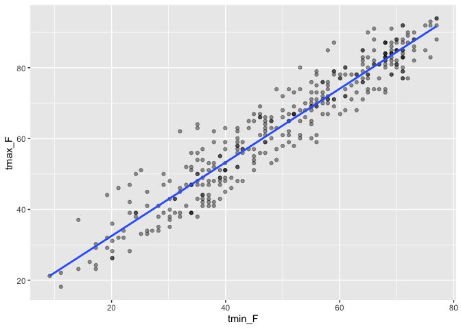
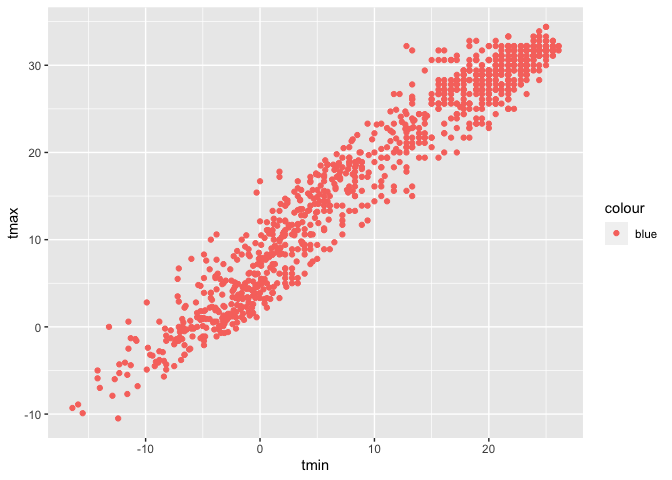
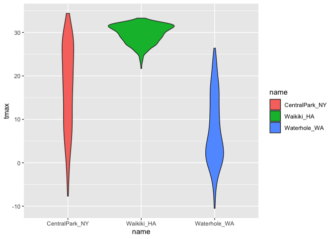
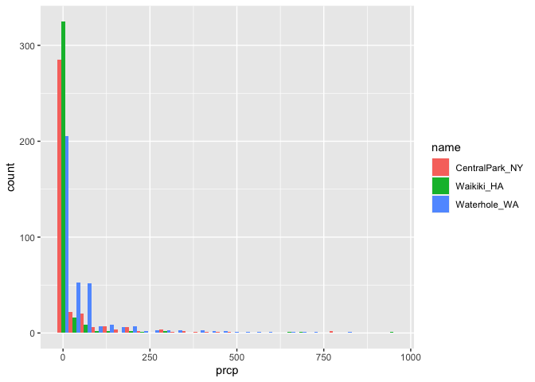
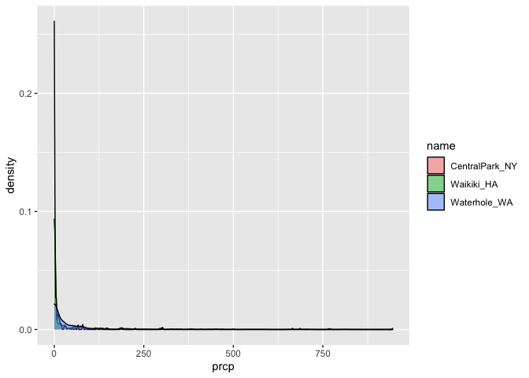
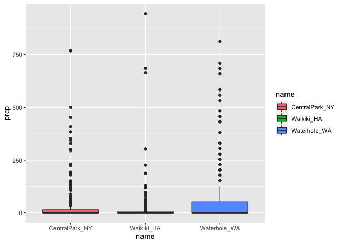
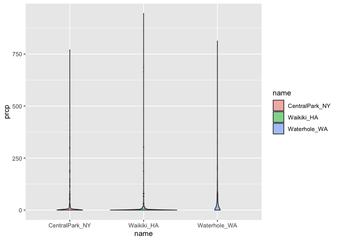
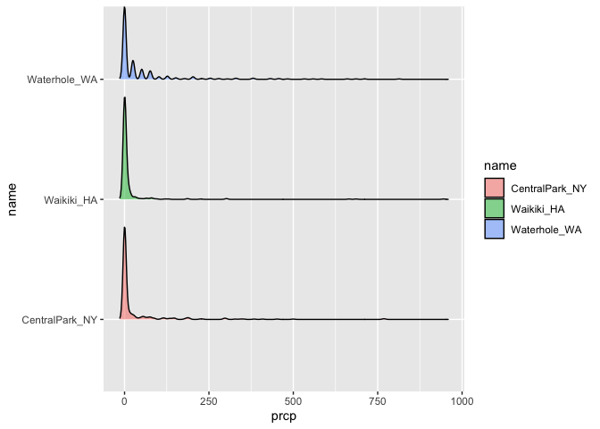

Visualization I
================
Lectured by Jeff Goldsmith
2022-09-29

### Prepare the weather dataset

Download the NOAA weather data and make the dataset clean and readable:

``` r
weather_df = 
  rnoaa::meteo_pull_monitors(
    c("USW00094728", "USC00519397","USS0023B17S"),
    var = c("PRCP", "TMIN", "TMAX"),
    date_min = "2017-01-01",
    date_max = "2017-12-31") %>% 
  mutate(
    name = recode(id, USW00094728 = "CentralPark_NY",
                      USC00519397 = "Waikiki_HA",
                      USS0023B17S = "Waterhole_WA"),
    tmin = tmin / 10,
    tmax = tmax / 10) %>% 
  select(name, id, everything())
```

### Basic Scatterplot

In the code chunk below, nothing will be shown in the graph because we
did not specify what type of `geom_`.

``` r
ggplot(weather_df, aes(x = tmin, y = tmax))
```

<!-- -->

Now if we add `geom_point()`, then R knows what type of graph we want to
plot.

``` r
ggplot(weather_df, aes(x = tmin, y = tmax)) + geom_point()
```

    ## Warning: Removed 15 rows containing missing values (geom_point).

<!-- -->

But there is a warning message from the code chunk above because there
are missing values in the variables. We can also make the same
scatterplot but in a different way (and drop those missing values).

``` r
weather_df %>% 
  drop_na() %>% 
  ggplot(aes(x = tmin, y = tmax)) + geom_point()
```

<!-- -->

We can also save the output of `ggplot()` to an object and modify/print
it later.

``` r
weather_scatterplot = 
  weather_df %>% 
  drop_na() %>% 
  ggplot(aes(x = tmin, y= tmax))

weather_scatterplot + geom_point()
```

<!-- -->

### Advanced Scatterplot

The previous scatterplots only show me a bunch of black dots. What if I
want to see the distribution of dots by different locations?

``` r
weather_df %>% 
  ggplot(aes(x = tmin, y = tmax, color = name)) + geom_point()
```

<!-- -->

Now we have a nicely looking graph with legend. What about adding a
smooth curve?

``` r
weather_df %>% 
  ggplot(aes(x = tmin, y = tmax)) + geom_point(aes(color = name)) + geom_smooth()
```

<!-- -->

But the code chunk above only show 1 blue line because we put the
aesthetic color = name in geom_point. If we put the aesthetic color in
the ggplot, it will show three lines with different colors.

``` r
weather_df %>% 
  ggplot(aes(x = tmin, y = tmax, color = name)) + geom_point() + geom_smooth()
```

<!-- -->

Let’s make the data points a bit more transparent, so we can see where
the dots overlap easily. `alpha =` the lower the value, the more
transparent it will be. `se =` display confidence interval around smooth
(TRUE by default).

``` r
weather_df %>% 
  ggplot(aes(x = tmin, y = tmax, color = name)) + 
  geom_point(alpha = 0.3) + 
  geom_smooth(se = FALSE)
```

<!-- -->

It seems difficult to view everything on the same graph because
everything is overlapping.

Let’s make separate panels; Make the same plot but separate by variables
– use `facet_grid`.

``` r
weather_df %>% 
  ggplot(aes(x = tmin, y = tmax, color = name)) + 
  geom_point(alpha = 0.3) + 
  geom_smooth(se = FALSE) +
  facet_grid(. ~ name)
```

<!-- -->

``` r
# If do facet_grid(name ~ .) will show horizontal graph instead of vertical.
```

Now I have learned enough about the relationship between `tmin` and
`tmax`, I want something that shows the time of year and something about
precipitation.

``` r
weather_df %>% 
  ggplot(aes(x = date, y = tmax, color = name)) + 
  geom_point(aes(size = prcp), alpha = .3) +
  geom_smooth(se = FALSE) +
  facet_grid(. ~ name)
```

<!-- -->

I can also make a line graph that only shows the relationship between
date and maximum temperature:

``` r
ggplot(weather_df, aes(x = date, y = tmax, color = name)) +
  geom_smooth(se = FALSE)
```

<!-- -->

When you’re making a scatterplot with lots of data, there’s a limit to
how much you can avoid overplotting using alpha levels and transparency.
In these cases, `geom_hex()`, `geom_bin2d()`, or `geom_density2d()` can
be handy.

``` r
weather_df %>% 
  ggplot(aes(x = tmin, y = tmax)) +
  geom_hex()
```

<!-- -->

### Learning Assessment 1

Write a code chain that starts with `weather_df`; focuses only on
Central Park, converts temperatures to Fahrenheit, makes a scatterplot
of min vs. max temperature, and overlays a linear regression line (using
options in `geom_smooth()`).

``` r
LA1_df = weather_df %>% 
  filter(name == "CentralPark_NY") %>% 
  mutate(
    tmax_F = tmax * (9 / 5) + 32,
    tmin_F = tmin * (9 / 5) + 32)
ggplot(LA1_df, aes(x = tmin_F, y = tmax_F)) +
  geom_point(alpha = 0.4) +
  geom_smooth(method = "lm", se = FALSE)
```

<!-- -->

### Learning Assessment 2

``` r
ggplot(weather_df) + geom_point(aes(x = tmax, y = tmin), color = "blue")
```

    ## Warning: Removed 15 rows containing missing values (geom_point).

<!-- -->

``` r
ggplot(weather_df) + geom_point(aes(x = tmin, y = tmax, color = "blue"))
```

    ## Warning: Removed 15 rows containing missing values (geom_point).

<!-- --> In the first
attempt, we’re defining the color of the points by hand. In the second
attempt, we’re implicitly creating a color variable that has the value
`blue` everywhere; `ggplot` is then assigning colors according to this
variable using the default color scheme.

### Univariate plots

Histograms, barplots, boxplots, violins, …

##### Histogram

We can show histograms with separate panels:

``` r
weather_df %>% 
  ggplot(aes(x = tmax, fill = name)) +   
  geom_histogram() +
  facet_grid(. ~ name)
```

    ## `stat_bin()` using `bins = 30`. Pick better value with `binwidth`.

    ## Warning: Removed 3 rows containing non-finite values (stat_bin).

<!-- -->

``` r
# If put color = name, the color will only show on the outer line, not the entire columns.
```

Or we can do this: The `position = "dodge"` places the bars for each
group side-by-side.

``` r
ggplot(weather_df, aes(x = tmax, fill = name)) +
  geom_histogram(position = "dodge", binwidth = 2)
```

<!-- -->

##### Density plot

The `adjust` parameter in density plots is similar to the `binwidth`
parameter in histograms, and it helps to try a few values. Lastly,
adding geom_rug() to a density plot can be a helpful way to show the raw
data in addition to the density.

``` r
weather_df %>% 
  ggplot(aes(x = tmax, fill = name )) +
  geom_density(alpha = .4, adjust = 0.5, color = "blue")
```

<!-- -->

``` r
# If use 'color = name' will only show color line; If use 'fill = name' will fill the entire space under line, so do alpha = .4 to make the color more transparent.
```

##### Boxplot

``` r
weather_df %>% 
  ggplot(aes(x = name, y = tmax, fill = name)) +
  geom_boxplot()
```

    ## Warning: Removed 3 rows containing non-finite values (stat_boxplot).

<!-- -->

###### Violin plot

``` r
weather_df %>% 
  ggplot(aes(x = name, y = tmax, fill = name)) +
  geom_violin(alpha = 0.4)
```

    ## Warning: Removed 3 rows containing non-finite values (stat_ydensity).

<!-- -->

##### Ridge plots

Ridge plots showing plots side-by-side instead of stacking all of them
on one layer.

``` r
weather_df %>% 
  ggplot(aes(x = tmax, y = name)) +
  geom_density_ridges(scale = 0.85)
```

    ## Picking joint bandwidth of 1.84

    ## Warning: Removed 3 rows containing non-finite values (stat_density_ridges).

<!-- -->

``` r
# Adjust the scale so bigger plots won't overlap.
```

### Learning Assessment 3

Make plots that compare precipitation across locations. Try a histogram,
a density plot, a boxplot, a violin plot, and a ridgeplot; use aesthetic
mappings to make your figure readable.

``` r
# Histogram
ggplot(weather_df, aes(x = prcp, fill = name)) + 
  geom_histogram(position = "dodge")
```

<!-- -->

``` r
# Density plot
ggplot(weather_df, aes(x = prcp)) +
  geom_density(aes(fill = name), alpha = 0.5)
```

<!-- -->

``` r
# Boxplot
ggplot(weather_df, aes(x = name, y = prcp, fill = name)) +
  geom_boxplot()
```

<!-- -->

``` r
# Violin plot
ggplot(weather_df, aes(x = name, y = prcp, fill = name)) +
  geom_violin(alpha = 0.5)
```

<!-- -->

``` r
# Ridgeplot
ggplot(weather_df, aes(x = prcp, y = name, fill = name)) +
  geom_density_ridges(alpha = 0.5, scale = 0.85)
```

<!-- -->

### Saving and embedding plots

First, let’s save a plot.

``` r
weather_scatterplot = weather_df %>% 
  ggplot(aes(x = date, y = tmax, color = name, size = prcp)) +
  geom_point(alpha = .3) +
  geom_smooth(se = FALSE) +
  facet_grid(. ~ name)

weather_scatterplot
```

<!-- -->

``` r
ggsave(
  file = "results/weather_scatterplot.pdf", 
  plot = weather_scatterplot,
  width = 10, height = 7)
```

Embedding plots: The size of the figure created by R, which is
controlled using two of the three chunk options `fig.width`,
`fig.height`, and `fig.asp`. I prefer a common width and plots that are
a little wider than they are tall, so I set options to fig.width = 6 and
fig.asp = .6. Second is the **size of the figure** inserted into your
document, which is controlled using `out.width` or `out.height`. I like
to have a little padding around the sides of my figures, so I set
`out.width` = “90%”.

``` r
knitr::opts_chunk$set(
  fig.width = 6,
  fig.asp = .6,
  out.width = "90%"
)
```
